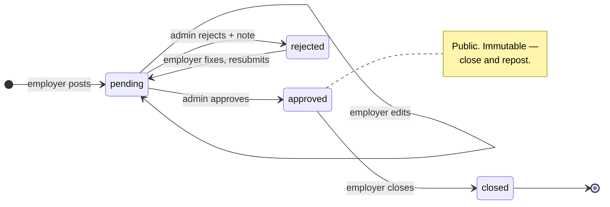

# Dev Job Board

[](https://github.com/febbryandika/dev-job-board/actions/workflows/ci.yml)

A developer job board for the Japanese market, built around an **approval workflow**: employers
post listings, an admin reviews every one before it goes public, candidates apply. Three roles,
a guarded status machine with an audit trail, and server-rendered public pages — because a job
board nobody can find is not a job board.

**[Live demo](https://example.com)** · *not yet deployed — see
[docs/DEPLOYMENT.md](docs/DEPLOYMENT.md)*

| Email | Role | Password |
| --- | --- | --- |
| `candidate@demo.dev` | candidate | `demo1234` |
| `employer@demo.dev` | employer | `demo1234` |
| `admin@demo.dev` | admin | `demo1234` |

## The loop


## What this project demonstrates

- **Approval workflow with RBAC** — three roles, five legal status transitions in one pure
  function, `reviewed_by` / `reviewed_at` on every decision.
- **Authorization as a SQL predicate** — `status = 'approved'` and `employer_id = session.user.id`
  live in the `WHERE` clause, not in a UI condition. Every Server Action re-checks the role; the
  route layout is not the boundary.
- **SSR for SEO** — Server Components, per-listing metadata, `JobPosting` JSON-LD, a sitemap, and a
  detail page that renders with JavaScript disabled.
- **Tested and shipped** — 253 unit tests over the transition matrix, Zod schemas and
  filter-to-SQL predicates, plus 9 Playwright specs covering the full loop against a real database.
  CI runs all of it, including migrations, on every push.

## The approval workflow



Only `approved` listings are publicly visible. `approved → approved` is absent on purpose, so a
listing cannot change out from under a candidate who already applied.

## Screenshots

| Public list | Employer dashboard | Moderation queue |
| --- | --- | --- |
|  |  |  |

## Stack

| Choice | Why |
| --- | --- |
| Next.js 16 App Router, React 19 | SSR is the point — public pages must be indexable |
| TypeScript, Zod | One schema validates the form and the Server Action |
| PostgreSQL 16, Drizzle ORM | Real FKs and a unique constraint enforcing a business rule |
| Better Auth | Email/password with a role field that clients cannot set |
| TailwindCSS, shadcn/ui | Accessible primitives without a component library to fight |
| Resend | Three transactional emails; failures never block a write |
| Vitest, Playwright | Pure logic in unit tests, the product loop end to end |

No TanStack Query, no Zustand: filters and pagination live in `searchParams` and render on the
server, so a client cache would only duplicate the data path.

## Local setup

Three commands on a clean clone. No accounts or API keys needed.

```bash
docker compose up -d
```

```bash
cp .env.example .env && pnpm install && pnpm db:migrate && pnpm db:seed
```

```bash
pnpm dev
```

The app runs at <http://localhost:3000>. Postgres is on host port **5435** so it does not clash
with a local install on 5432.

The seed is safe to re-run — it deletes the three demo users first and everything they own cascades
away, so nothing you created by hand is touched. It loads 20 listings across all four statuses
(12 approved, 4 pending, 2 rejected, 2 closed), so the moderation queue and the rejected → resubmit
path are both non-empty on first load.

## Environment

`.env.example` works as-is against the Docker Postgres. Only two values ever need changing.

| Variable | How to get it |
| --- | --- |
| `DATABASE_URL` | Already correct for `docker compose`. In production, the pooled Neon connection string |
| `BETTER_AUTH_SECRET` | `openssl rand -base64 32` |
| `BETTER_AUTH_URL` | `http://localhost:3000` locally; your real origin in production |
| `RESEND_API_KEY` | [resend.com](https://resend.com) → API Keys. **Leave blank locally** — emails are logged to the console instead of sent |
| `EMAIL_FROM` | Optional. Defaults to Resend's shared sender, which needs no domain verification |

## Scripts

| Script | What it does |
| --- | --- |
| `pnpm dev` | Development server |
| `pnpm build` / `pnpm start` | Production build and serve |
| `pnpm lint` | ESLint |
| `pnpm typecheck` | `tsc --noEmit` |
| `pnpm test` | Vitest unit tests — no database needed |
| `pnpm test:e2e` | Playwright. Needs Postgres running, migrated and seeded, plus `pnpm exec playwright install chromium` once |
| `pnpm db:generate` | Generate a SQL migration into `drizzle/` — commit it |
| `pnpm db:migrate` | Apply migrations |
| `pnpm db:seed` | Seed demo users and listings |

Migrations are **generated, committed and applied** — never `drizzle-kit push`. The `drizzle/`
folder is real SQL history.

## Roles

`candidate` and `employer` are chosen at sign-up. **`admin` is never self-service** — the role
field is `input: false` on the Better Auth user, so it cannot be set from a client payload, and the
sign-up schema only accepts the other two. Promote by hand:

```bash
docker exec dev-job-board-postgres psql -U postgres -d dev_job_board -c "UPDATE \"user\" SET role = 'admin' WHERE email = 'you@example.com';"
```

The seeded `admin@demo.dev` already has the role.

## Documentation

- [Architecture](docs/ARCHITECTURE.md) — request flow, the four invariants, status machine, folder
  structure
- [Server interface](docs/API.md) — every query and Server Action, with roles and effects
- [Database](docs/DATABASE.md) — ER diagram, columns, indexes, migrations
- [Deployment](docs/DEPLOYMENT.md) — Vercel + Neon, including the migration step

## Future improvements

- **Resume uploads.** A URL field is deliberate here — object storage is a different project's
  problem — but a real board would host the file.
- **`CHECK` constraints on the enum columns.** `status`, `location_type` and `role_type` are typed
  in TypeScript and validated by Zod, but stored as plain `text`. The database should refuse a bad
  value too.
- **Full-text search.** `ILIKE` on title and company is right at this size; `tsvector` earns its
  keep once listings grow.
- **Integration tests for the query and action layer.** Today those are covered only through
  Playwright — good coverage, slow feedback.
- **Saved searches, job alerts, company profiles.** All out of scope on purpose; each one is a
  feature, not a refinement.
