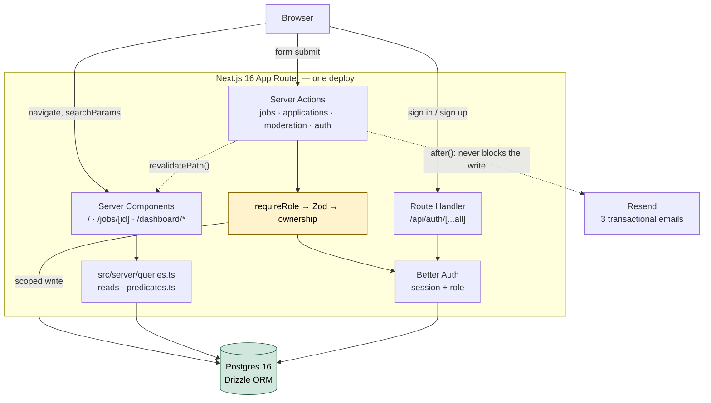

# Architecture

One Next.js App Router app, one deploy. No separate API server, no monorepo, no RPC client.

## How a request flows



Three lanes, and nothing crosses between them:

- **Reads** — Server Components call [`src/server/queries.ts`](../src/server/queries.ts) directly.
  No fetch layer, no client cache.
- **Writes** — Server Actions in [`src/server/actions/`](../src/server/actions/). Each one
  re-establishes who is asking before it touches the database.
- **Auth** — one Route Handler, Better Auth's. It is the only one in the app.

TanStack Query and Zustand are deliberately absent. Filters and pagination live in `searchParams`
and render on the server, so a client cache and a client store would duplicate the RSC data path
and give it a second source of truth.

## The four invariants

These carry the design. Breaking one is a correctness bug, not a style preference.

**1. Every Server Action re-checks the role.** `dashboard/layout.tsx` calls `requireUser()`, but a
layout is never the authorization boundary — it establishes a session and nothing more. Each action
independently runs `requireRole()` → Zod `safeParse` → ownership check → write → `revalidatePath()`.
The E2E suite forges action payloads from the wrong account to prove the layout is not what is
holding the door.

**2. Actions return a result, they do not throw.** `{ ok: true } | { ok: false, error }`, where
`error` is Zod's `flatten()` output. One envelope for validation failures and business failures
alike, so every form renders errors the same way.

**3. Authorization is a SQL predicate, not a UI condition.** `status = 'approved'` is in the public
query's `WHERE` clause; `employer_id = session.user.id` is in the same statement that performs the
write. A page cannot fetch rows it then has to remember to hide.

**4. No N+1.** Applicant counts on the employer dashboard are a `LEFT JOIN` + `GROUP BY` in one
round trip. The public list is one query for the page and one for the count.

## The approval workflow

Every transition rule lives in one pure function,
[`canTransition(from, to, actorRole)`](../src/lib/transitions.ts), so the employer actions, the
admin queue and the edit page cannot disagree about the rules. Five transitions are legal and
everything else — including every `closed → *` — is not.

| From | To | Actor | Meaning |
| --- | --- | --- | --- |
| `pending` | `pending` | employer | Edit while awaiting review; status unchanged |
| `rejected` | `pending` | employer | Fix and resubmit |
| `approved` | `closed` | employer | Stop accepting applications |
| `pending` | `approved` | admin | Goes public; stamps `approved_at` |
| `pending` | `rejected` | admin | Requires a note of 10+ characters |

`approved → approved` is absent on purpose: an approved listing is immutable, so nothing can be
edited out from under a candidate who already applied. Close and repost instead. `EDITABLE_STATUSES`
is *derived* from the same table rather than written out a second time, which is what keeps the SQL
predicate in `updateJob` from drifting away from the guard.

Every admin decision stamps `reviewed_by` and `reviewed_at` — a minimal audit trail.

## SEO

The reason this is a fullstack Next.js app rather than a SPA:

- `/` and `/jobs/[id]` are Server Components — full HTML on first byte, and the detail page renders
  with JavaScript disabled (an E2E test asserts this).
- `generateMetadata` per listing, with `robots: { index: false }` for anything not approved.
- `JobPosting` JSON-LD on the detail page, for Google Jobs.
- `sitemap.ts` emits every approved listing; `robots.ts` keeps crawlers out of `/dashboard`.
- The detail page is ISR (`revalidate = 60`) and approving a listing busts its path immediately, so
  a cached 404 does not outlive the approval.

## Folder structure

```
src/
├── app/
│   ├── layout.tsx                     # skip link, header, footer, metadata template
│   ├── error.tsx  not-found.tsx
│   ├── sitemap.ts  robots.ts
│   ├── (home)/                        # public list — page, loading, error
│   ├── jobs/[id]/                     # public detail + generateMetadata + JSON-LD
│   ├── (auth)/login/  (auth)/register/
│   ├── dashboard/
│   │   ├── layout.tsx                 # session guard (not the authz boundary)
│   │   ├── error.tsx                  # renders 403 for ForbiddenError
│   │   ├── page.tsx                   # redirects to the right home per role
│   │   ├── employer/                  # (overview), new, [id]/edit, [id]/applications
│   │   ├── admin/                     # moderation queue
│   │   └── applications/              # candidate's own applications
│   └── api/auth/[...all]/route.ts     # the only Route Handler
├── components/                        # job-card, job-filters, apply-dialog,
│   └── ui/                            # application-table, moderation-queue, …
├── db/
│   ├── schema.ts                      # jobs, applications
│   ├── auth-schema.ts                 # generated by Better Auth
│   ├── index.ts                       # pool + db handle
│   └── seed.ts                        # demo users + 20 listings
├── lib/
│   ├── auth.ts  auth-client.ts        # Better Auth config
│   ├── session.ts  roles.ts           # requireUser / requireRole / hasRole
│   ├── transitions.ts                 # canTransition — the status machine
│   ├── validation.ts                  # every Zod schema + ActionResult
│   ├── email.ts                       # Resend client + 3 templates
│   ├── markdown.ts  json-ld.ts        # sanitize, JobPosting
│   └── format.ts  site.ts  utils.ts
├── server/
│   ├── queries.ts                     # reads
│   ├── predicates.ts                  # filter → SQL, testable without a DB
│   └── actions/                       # jobs, applications, moderation, auth
└── tests/                             # Vitest — 10 suites, pure functions only

e2e/                                   # Playwright — 9 specs + fixtures
drizzle/                               # committed SQL migration history
docs/                                  # this folder
```

Two placements are deliberate:

- `roles.ts` is separate from `session.ts` and imports nothing, so the client-side `error.tsx` can
  use `hasRole` and the `FORBIDDEN` digest without pulling the server auth config into the bundle.
- `predicates.ts` is separate from `queries.ts` for the same reason in the other direction: that
  module opens the connection pool, and the filter-to-SQL tests need to run without a database.

## Testing

**Vitest** — 10 suites over pure functions: the full status × role transition matrix, every Zod
schema, filter-to-SQL predicates (asserted against generated SQL, no database), the JPY formatter's
open-ended ranges, markdown sanitization against XSS payloads, JSON-LD shape, and email templates.

**Playwright** — 9 specs against a real database, including the whole product loop: employer posts
→ not public → admin approves → public → candidate applies → employer sees it → a second apply is
blocked. Plus the rejection path, forged-payload authorization attempts, JS-disabled rendering, and
a keyboard/accessibility pass.

CI runs lint, typecheck, unit tests, migrations against an empty Postgres, seed, build, then the
Playwright suite against the **production** build.
