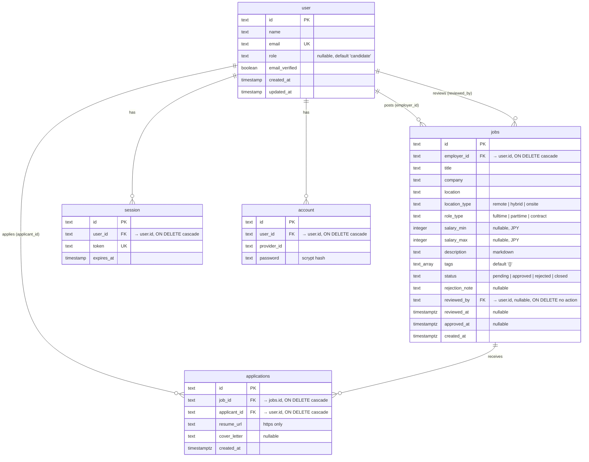

# Database

Postgres 16. Schema lives in [`src/db/schema.ts`](../src/db/schema.ts) (application tables) and
[`src/db/auth-schema.ts`](../src/db/auth-schema.ts) (generated by Better Auth). Everything below is
transcribed from those two files and the migration they produced.

Six tables: two the app owns, four Better Auth owns. The app tables hold real foreign keys into
`user`, so `employer_id` and `applicant_id` are joins, not loose id strings.

## Entity relationships



`verification` (Better Auth, for email/token flows) is omitted from the diagram — nothing in this
app references it.

## Tables the app owns

### `jobs`

| Column | Type | Null | Default | Notes |
| --- | --- | --- | --- | --- |
| `id` | `text` | no | cuid2 | primary key |
| `employer_id` | `text` | no | — | → `user.id`, `ON DELETE cascade` |
| `title` | `text` | no | — | |
| `company` | `text` | no | — | |
| `location` | `text` | no | — | free text, e.g. `Shibuya, Tokyo` |
| `location_type` | `text` | no | — | `remote` \| `hybrid` \| `onsite` |
| `role_type` | `text` | no | — | `fulltime` \| `parttime` \| `contract` |
| `salary_min` | `integer` | yes | — | whole yen |
| `salary_max` | `integer` | yes | — | whole yen |
| `description` | `text` | no | — | markdown, sanitized at render |
| `tags` | `text[]` | no | `'{}'` | max 8, 24 chars each |
| `status` | `text` | no | `'pending'` | `pending` \| `approved` \| `rejected` \| `closed` |
| `rejection_note` | `text` | yes | — | required when an admin rejects |
| `reviewed_by` | `text` | yes | — | → `user.id`, `ON DELETE no action` |
| `reviewed_at` | `timestamptz` | yes | — | audit trail |
| `approved_at` | `timestamptz` | yes | — | drives public ordering and the sitemap |
| `created_at` | `timestamptz` | no | `now()` | |

Salary is nullable on both ends on purpose: a listing may publish a minimum only, a maximum only,
or neither. [`src/lib/format.ts`](../src/lib/format.ts) handles all four cases.

### `applications`

| Column | Type | Null | Default | Notes |
| --- | --- | --- | --- | --- |
| `id` | `text` | no | cuid2 | primary key |
| `job_id` | `text` | no | — | → `jobs.id`, `ON DELETE cascade` |
| `applicant_id` | `text` | no | — | → `user.id`, `ON DELETE cascade` |
| `resume_url` | `text` | no | — | validated as an `https` URL before insert |
| `cover_letter` | `text` | yes | — | max 5000 chars |
| `created_at` | `timestamptz` | no | `now()` | |

## Indexes and constraints

| Name | Table | Columns | Why it exists |
| --- | --- | --- | --- |
| `uq_application` | `applications` | `(job_id, applicant_id)` | One application per candidate per listing — the business rule, enforced by the database |
| `idx_jobs_public` | `jobs` | `(status, approved_at)` | Serves the public list *and* the sitemap; matches `WHERE status = 'approved' ORDER BY approved_at DESC` |
| `idx_jobs_employer` | `jobs` | `(employer_id)` | Employer dashboard |
| `idx_applications_job` | `applications` | `(job_id)` | Applicant list per listing, and the dashboard's count join |
| `idx_applications_applicant` | `applications` | `(applicant_id)` | Candidate's own applications |

`uq_application` is the point worth dwelling on. The apply button disables itself once you have
applied, but that is a convenience. The guarantee is the unique constraint: `applyToJob` catches
Postgres error `23505` on this specific constraint and turns it into a field error. An E2E test
posts a duplicate application with the UI bypassed to prove it.

## Two things the schema does *not* do

**The enums are TypeScript-only.** `location_type`, `role_type` and `status` are declared with
Drizzle's `{ enum: [...] }`, which types the columns in TypeScript but emits plain `text` — no
Postgres enum type, no `CHECK` constraint. Zod validates every value before it reaches a write, so
nothing invalid gets in through the app, but a hand-written `INSERT` at the psql prompt would be
accepted. Adding `CHECK` constraints is on the improvement list.

**`user.role` is nullable.** Better Auth generated it as `text DEFAULT 'candidate'` without
`NOT NULL`. `hasRole()` in [`src/lib/roles.ts`](../src/lib/roles.ts) compares with `===`, so a null
role satisfies no role and fails closed.

Timestamps also differ between the two halves: app tables use `timestamptz`, the Better Auth tables
use bare `timestamp`. That is Better Auth's generated schema, left as-is so regenerating it stays a
no-op.

## Migrations

Generated, committed, applied — never `drizzle-kit push`. The `drizzle/` folder is real SQL history
you can read and roll forward.

```bash
pnpm db:generate   # diff schema.ts → drizzle/NNNN_name.sql (commit this)
pnpm db:migrate    # apply pending migrations
pnpm db:seed       # demo users + 20 listings across all four statuses
```

CI applies migrations against an empty Postgres on every push, which is the only way a migration
that no longer applies cleanly gets caught before deploy.

The seed is re-runnable: it deletes the three demo users first and lets `ON DELETE cascade` clear
their jobs and applications, so anything you created by hand survives. Because `jobs.reviewed_by`
is `ON DELETE no action`, the seed nulls that column before deleting the admin — worth knowing if
you write your own cleanup script.
